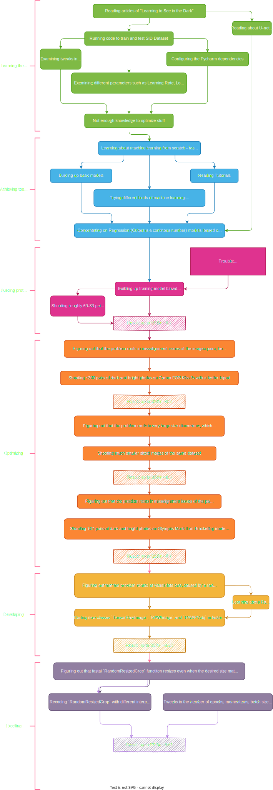
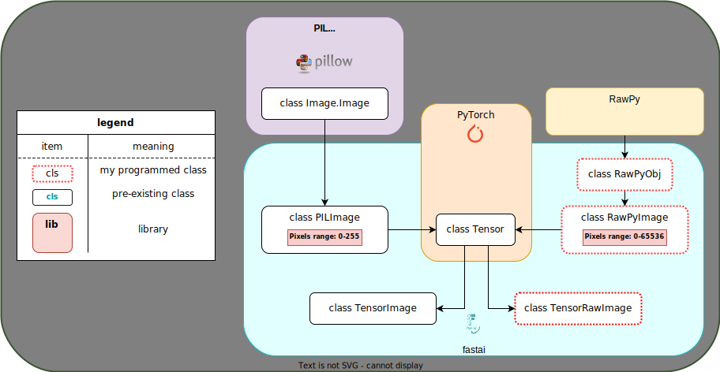

(Not completed yet)

# Reconstructing Dark Images
### TL;DR: How to restore dark images into bright fully-detailed images with Deep Learning
This github repository displays the entire process of building up this project, of restoring lost data in dark images into bright fully-detailed images with neural networks.


# Why use Deep Learning? 
### (or more precisely: Why use CNNs?)
The algorithmic methods of improving low light images, could be Gamma Correction, Histogram Balance, Denoising and so forth, but these methods don't consistently yield authentic results for every case.

When an image is taken under low light conditions, very little light comes in the sensor of the camera, hence it's more sensitive to noise coming in as well. 

By using the traditional methods, the stored visual data is amplified along with the noise too. 

Denoising could help, but what pixels are considered as noise and what some aren't?

Such an algorithm could be easily developed by using Neural Network, mostly because we have a plenty of data to feed the model on. 

The concept here is to provide pairs of dark and bright images of the same objects, in batches, so the model is trained to recognise patterns and features that should be amplified.

# Performance
How could we measure the performance?
What metrics would be the best to use?

The answers are, so far:
1. PSNR (Peak Signal-to-Noise Ratio)
2. SSIM (Structural Similarity)

I have used existing code implementations for these metrics.

For instance, the PSNR code in python is:
```
def psnr(pred, targs, data_range=1):
    mse = F.mse_loss(pred, targs)
    return 20 * torch.log10(data_range / torch.sqrt(mse))
```

> Note: Data range is 1, because tensors contain values between 0 to 1 that were mapped into from the pixels' values.


# Goals
#### 1. Learn: 
> Gather knowlodge about Deep learning, especially Residual Networks and Unet Networks

#### 2. Try: 
> Programm a neureal network that is trained with dark images and their paired bright images

#### 3. Improve: 
> Optimize its specifications, as in batch-size, depth of layers, input files sizes, learning rates, and so on

#### 4. Compare: 
> Use SID dataset by <insert credits here> and examine our performance to theirs
    
#### 5. Ace:
> Tweak current architectures or develop better architectures for deep learning
    
# Architecture


# Dataset
    (tocomplete)
    
# Methodology
<p align="center">
  
</p>
    
# class TensorRawImage + class RAWImage
### First off, what is the difference between JPG and RAW formats?
JPG format has a depth bit of 8bits for every channel (R,G,B), meaning: every pixel gets values in between 0 up to 255.
> 2^8=255
  
RAW format has a depth bit of 16bits for every channel (R,G,B[,G]), meaning: every pixel gets values in between 0 up to... 65536!
> 2^16=65536

Therefore, a RAW image file would normally have a larger range of value for every pixel, which can help the model training become more precise, when switching from JPG to RAW.
> Note: in practice, every DSLR stors RAW files and postprocesses these files into other formats. For instance, it crops and compresses the JPG image out of the RAW file.

### Problem: PIL doesn't support RAW files
  
In order to improve the training process, I figured out that using RAW files would yield in more details. Problem was that fastai has been based on `PIL` for handling image files, which doesn't support RAW files. Therefore, I needed to create new classes that inherit feautres from `rawpy` library, that support RAW files.
  
### new classes
<p align="center">
  
</p>

# Results
    (tocomplete)

# Comparasion to SID (See in The Dark dataset)
    
    (tocomplete)
    
# Special Thanks
    
# References
- Chen Chen, Qifeng Chen, Jia Xu, and Vladlen Koltun, "Learning to See in the Dark", in CVPR, 2018.
