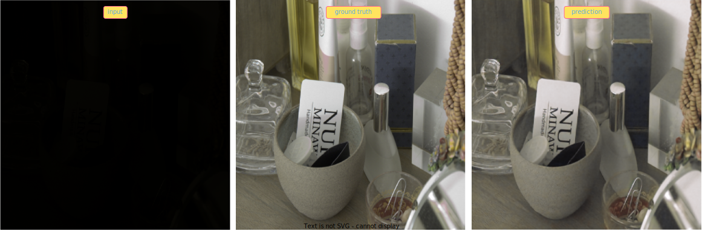
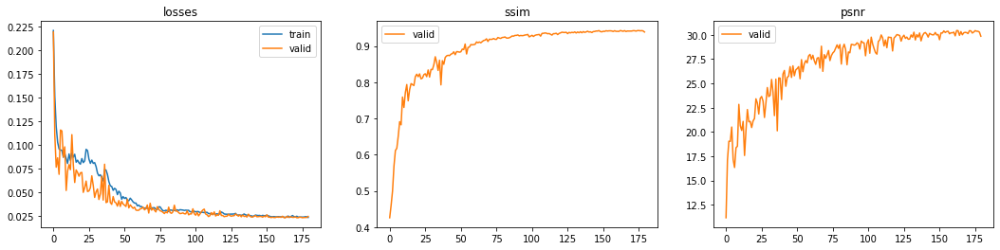

(README not completed yet)

# Reconstructing Dark Images
### TL;DR: Restoring dark images into bright fully-detailed images with Deep Learning


# Why use Deep Learning? 
### Background
There are algorithmic methods of improving low light images, such as: Gamma Correction, Histogram Balance, Denoising and so forth, but these methods don't consistently yield authentic results for every case.

Upon taking a photo under low light conditions, the reflected light beams of the objects come into the sensor of the camera, however due to low light conditions, the sensor is more sensitive to noise coming inside as well. 

### The problem
By using the traditional algorithmic methods, the recieved visual data is amplified along with the noise too. 

Denoising could help, but what pixels are considered as noise and what some aren't?

### The solution
Such an algorithm could be easily developed by using Convolutional Neural Network, mostly because we have a plenty of data to feed the model on. 

### Methodology
The concept here is to provide pairs of dark and bright images of the same objects, in batches, so the model is trained to recognise patterns and features that should be amplified.

# Metrics / Performance
1. PSNR (Peak Signal-to-Noise Ratio)
2. SSIM (Structural Similarity)
3. Illumaninace [lux]

I have used existing code implementations for these metrics.

For instance, the PSNR code in python is:
```
def psnr(pred, targs, data_range=1):
    mse = F.mse_loss(pred, targs)
    return 20 * torch.log10(data_range / torch.sqrt(mse))
```

> Note: Data range is 1, because tensors contain pixels' values of mapped values between 0 to 1.

# Goals
1. Learn: Gather knowlodge about Deep learning, especially Residual Networks and Unet Networks
2. Try: Programm a neureal network that is trained with dark images and their paired bright images
3. Improve: Optimize its specifications, as in batch-size, depth of layers, input files sizes, learning rates, and so on
4. Compare: Use SID dataset [1] and examine our performance to theirs
5. Ace: Tweak current architectures or develop better architectures for deep learning
    
# Architecture


# More results


# Dataset
    (to complete links for downloading, explanationss)
    
# Methodology


# Metrics Evaluation (Performance)
    
<p align="center">
  
</p>
    
# Comparasion to SID (See in The Dark dataset)
    (to complete insights about training SID, about testing SID, comparing SSIM and PSNR)

# Developing

After making this work complete, I've created a new package `fastai-rawpy` that lets importing `rawpy` into `fastai` and hence, use better quality of images, by using RAW image files. For more info:

https://github.com/lejrn/fastai-RawPy
    
# Special Thanks
- Big thanks to both Or Biton, my partner, and our guiding professional figure, Prof. Adrian Stern. 
- Further thanks to the fast.ai community, especially its founder Jeremy Howdy.
    
# References
[1] [Chen Chen, Qifeng Chen, Jia Xu, and Vladlen Koltun, "Learning to See in the Dark", in CVPR, 2018.](https://github.com/cchen156/Learning-to-See-in-the-Dark#learning-to-see-in-the-dark)
[2] [Neural Blind Deconvolution Using Deep Priors (CVPR 2020)](https://github.com/csdwren/SelfDeblur#neural-blind-deconvolution-using-deep-priors)
