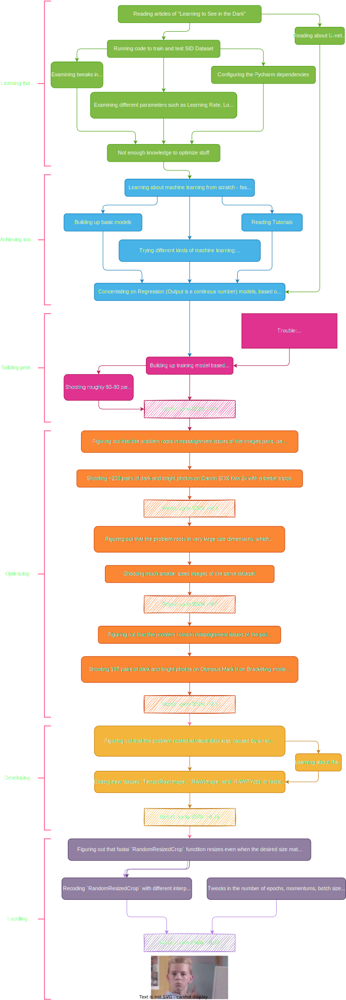
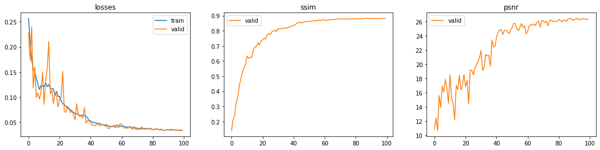

(Not completed yet)

# Reconstructing Dark Images
### TL;DR: How to restore dark images into bright fully-detailed images with Deep Learning
In the following GIF, the image of the pillow, picked up from the `validation` dataset, is being predicted and decoded once again every after an epoch ends. As the model is being trained more and more by the `train` dataset, the predicting becomes more successful. The loss graph shows the model's loss values as training goes on.


# Why use Deep Learning? 
### (or more precisely: Why use CNNs?)
The algorithmic methods of improving low light images, could be for instance: Gamma Correction, Histogram Balance, Denoising and so forth, but these methods don't consistently yield authentic results for every case.

When an image is taken under low light conditions, very little light comes in the sensor of the camera, hence it's more sensitive to noise coming in as well. 

By using the traditional methods, the stored visual data is amplified along with the noise too. 

Denoising could help, but what pixels are considered as noise and what some aren't?

Such an algorithm could be easily developed by using Neural Network, mostly because we have a plenty of data to feed the model on. 

The concept here is to provide pairs of dark and bright images of the same objects, in batches, so the model is trained to recognise patterns and features that should be amplified.

# Performance
How could we measure the performance?
What metrics would be the best to use?

The answers are, so far:
1. PSNR (Peak Signal-to-Noise Ratio)
2. SSIM (Structural Similarity)

I have used existing code implementations for these metrics.

For instance, the PSNR code in python is:
```
def psnr(pred, targs, data_range=1):
    mse = F.mse_loss(pred, targs)
    return 20 * torch.log10(data_range / torch.sqrt(mse))
```

> Note: Data range is 1, because tensors contain values between 0 to 1 that were mapped into from the pixels' values.


# Goals
1. Learn: Gather knowlodge about Deep learning, especially Residual Networks and Unet Networks
2. Try: Programm a neureal network that is trained with dark images and their paired bright images
3. Improve: Optimize its specifications, as in batch-size, depth of layers, input files sizes, learning rates, and so on
4. Compare: Use SID dataset by <insert credits here> and examine our performance to theirs
5. Ace: Tweak current architectures or develop better architectures for deep learning
    
# Architecture


# Dataset
    (to complete links for downloading, explanationss)
    
# Methodology


# More Results
    (to complete graphs of PSNR, SSIM, some nice restoration of images, videos, etc)
    
<p align="center">
  
</p>
    
# Comparasion to SID (See in The Dark dataset)
    (to complete insights about training SID, about testing SID, comparing SSIM and PSNR)

# Developing
    
# Special Thanks
- Big thanks to both Or Biton, my partner, and our guiding professional figure, Prof. Adrian Stern. 
- Further thanks to the fast.ai community, especially Jeremy Howdy.
    
# References
- [Chen Chen, Qifeng Chen, Jia Xu, and Vladlen Koltun, "Learning to See in the Dark", in CVPR, 2018.](https://github.com/cchen156/Learning-to-See-in-the-Dark#learning-to-see-in-the-dark)
- [Neural Blind Deconvolution Using Deep Priors (CVPR 2020)](https://github.com/csdwren/SelfDeblur#neural-blind-deconvolution-using-deep-priors)
